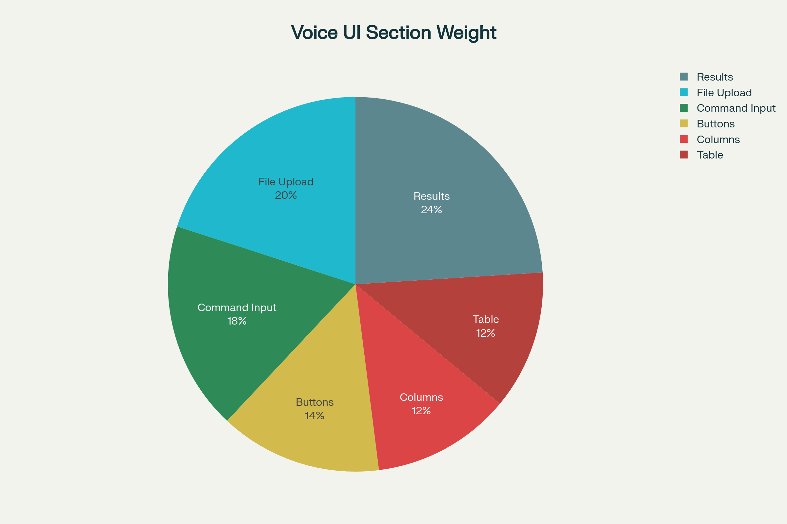

# P.A.N.D-A (Pandas Assistant for Natural Data Analytics)

My Plan for next few days
```text
+----------------+       +----------------+       +----------------+
|                |       |                |       |                |
|  Web Browser   |<----->| Mobile Device  |<----->|   Python API   |
| (React/Vue/Ang)|       | (Flutter/RN)   |       |  (FastAPI/Flask)|
|                |       |                |       |                |
+----------------+       +----------------+       +----------------+
        ^                       ^                       |
        |                       |                       |
        |  HTTPS/REST APIs      |                       |  Internal Calls
        | (JSON data)           |                       |
        v                       v                       v
+------------------------------------------------------------------+
|           Python Backend Logic (CommandPipeline,                 |
|           OpenRouterParser, PandasProcessor, AudioHandler)       |
+------------------------------------------------------------------+

```

A Professional way to handle the UI, which I found on Reddit:

